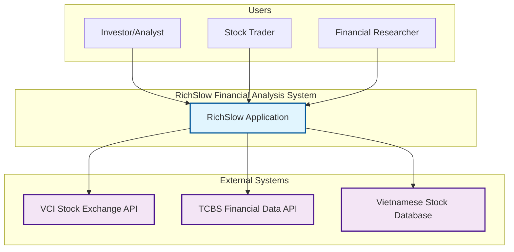
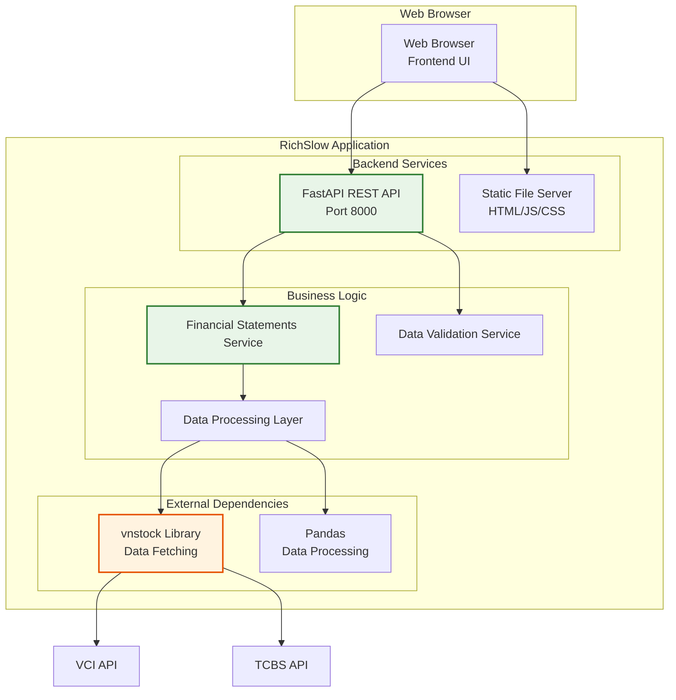
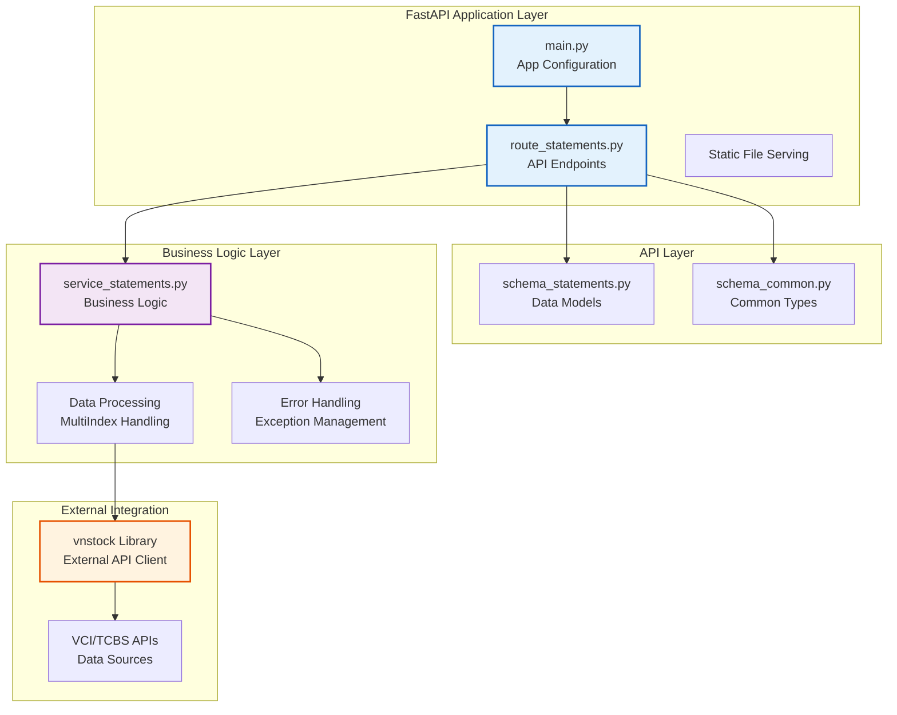
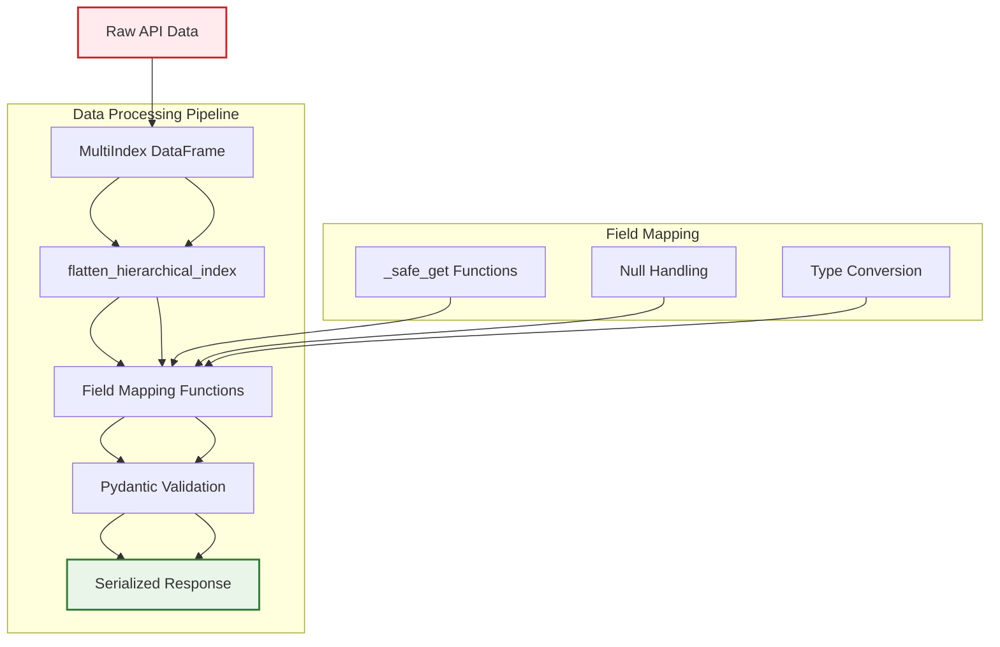

# Architecture Documentation - RichSlow

## Table of Contents
1. [System Overview](#system-overview)
2. [C4 Model Architecture](#c4-model-architecture)
   - [Level 1: System Context](#level-1-system-context)
   - [Level 2: Container Diagram](#level-2-container-diagram)
   - [Level 3: Component Diagram](#level-3-component-diagram)
   - [Level 4: Code Level](#level-4-code-level)
3. [System Context and Integrations](#system-context-and-integrations)
4. [Container and Service Architecture](#container-and-service-architecture)
5. [Component and Module Architecture](#component-and-module-architecture)
6. [Data Architecture](#data-architecture)
7. [Security Architecture](#security-architecture)
8. [Quality Attributes](#quality-attributes)
9. [Architecture Decision Records](#architecture-decision-records)
10. [Deployment Architecture](#deployment-architecture)

---

## System Overview

RichSlow is a Vietnamese stock market financial analysis web application that provides comprehensive financial data and analysis tools for investors and analysts. The system follows a clean architecture pattern with clear separation between backend API services and frontend presentation layers.

### Key Components
- **Backend API**: FastAPI-based REST API serving financial data
- **Frontend UI**: Static HTML/JavaScript web interface
- **Data Sources**: Vietnamese stock exchanges via vnstock library
- **Deployment**: Single-container application with uvicorn server

---

## C4 Model Architecture

### Level 1: System Context



**Purpose**: Shows the system boundaries and interactions with external entities.

**Key Interactions**:
- Users access financial analysis tools through web interface
- System integrates with multiple Vietnamese stock data sources
- No direct integration with payment or trading systems (read-only data)

### Level 2: Container Diagram



**Technology Stack**:
- **Frontend**: Static HTML with TailwindCSS, vanilla JavaScript
- **Backend**: FastAPI with Pydantic validation
- **Data Processing**: Pandas with vnstock integration
- **Server**: Uvicorn ASGI server
- **Protocol**: HTTP/HTTPS with RESTful API

### Level 3: Component Diagram



**Component Responsibilities**:
- **Main**: Application configuration, CORS setup, route mounting
- **Routes**: HTTP endpoint handling, request/response validation
- **Schemas**: Pydantic models for data validation and serialization
- **Service**: Business logic, data transformation, error handling
- **VNStock**: External API integration, data fetching

### Level 4: Code Level

#### Application Structure
```
app/
├── main.py                 # FastAPI application entry point
├── routes/
│   ├── __init__.py
│   └── route_statements.py # Financial statements API endpoints
├── schemas/
│   ├── __init__.py
│   ├── schema_common.py    # Common types and enums
│   └── schema_statements.py # Financial data models
└── services/
    ├── __init__.py
    └── service_statements.py # Business logic layer
static/
├── index.html              # Landing page
├── statements.html         # Financial statements display
└── js/
    ├── common.js           # Shared utilities
    └── statements.js       # Statements page logic
```

#### Key Data Models
```python
# Financial Statement Data Models
class IncomeStatementData:
    # 28 fields covering revenue, expenses, profits, taxes
    fields: Revenue, COGS, GrossProfit, OperatingExpenses...
    
class BalanceSheetData:
    # 39 fields covering assets, liabilities, equity
    fields: Cash, Receivables, Inventory, Liabilities...
    
class CashFlowData:
    # 36 fields covering operating, investing, financing
    fields: OperatingCashFlow, InvestingCashFlow...

class FinancialRatiosData:
    # 34+ fields covering comprehensive financial analysis
    fields: ROE, ROA, DebtToEquity, CashConversionCycle...
```

---

## System Context and Integrations

### External Dependencies

#### Data Sources
1. **VCI (Vietnam Capital Investments)**
   - Primary source for real-time stock data
   - Provides financial statements, stock prices
   - Rate limits: ~100 requests per minute

2. **TCBS (Techcom Securities)**
   - Alternative data source for financial statements
   - Used as fallback when VCI is unavailable
   - Comprehensive historical data coverage

3. **Vietnamese Stock Database**
   - Reference data for company information
   - Stock tickers, company details, market information

#### Third-Party Libraries
- **vnstock v3.2.6**: Vietnamese stock market data library
- **FastAPI v0.104.1**: Web framework for API development
- **Pandas v2.1.0**: Data manipulation and analysis
- **Pydantic v2.5.0**: Data validation using Python type annotations

### Integration Patterns

#### API Gateway Pattern
- Single entry point through FastAPI application
- Route-based separation of concerns
- Centralized error handling and validation

#### Data Integration Strategy
- Library-based integration (vnstock)
- Standardized data models with Pydantic
- MultiIndex DataFrame handling for complex financial data
- Safe data extraction with null handling

---

## Container and Service Architecture

### Service Architecture

#### Backend Services
1. **Financial Statements Service**
   - **Responsibility**: Core business logic for financial data
   - **Endpoints**: `/api/statements/{ticker}`
   - **Processing**: Data fetching, transformation, validation
   - **Error Handling**: Comprehensive exception management

2. **Static File Service**
   - **Responsibility**: Serve frontend HTML/JS/CSS files
   - **Mount Point**: `/static`
   - **Caching**: Browser-level caching for static assets

3. **API Documentation Service**
   - **Responsibility**: Auto-generated OpenAPI/Swagger docs
   - **Endpoints**: `/api/docs`, `/api/redoc`
   - **Features**: Interactive API testing, schema validation

### Deployment Architecture

#### Current Deployment
- **Server Type**: Single-container application
- **Process Manager**: Uvicorn ASGI server
- **Port**: 8000 (configurable)
- **Static Serving**: Built-in FastAPI static file handler

#### Scalability Considerations
- **Horizontal Scaling**: Stateless design allows multiple instances
- **Load Balancing**: Can be deployed behind reverse proxy (nginx)
- **Database**: Currently stateless (no persistent storage)
- **Caching**: Opportunity for Redis implementation

### Communication Patterns

#### Request-Response Pattern
- **HTTP Methods**: GET, POST for API endpoints
- **Response Format**: JSON with Pydantic validation
- **Error Handling**: HTTP status codes with detailed error messages

#### Event-Driven Pattern (Future)
- **Real-time Updates**: WebSocket support planned
- **Data Streaming**: Financial data updates via Server-Sent Events
- **Notification System**: Email/SMS alerts for significant changes

---

## Component and Module Architecture

### Module Organization

#### Presentation Layer (Frontend)
- **static/index.html**: Landing page with input form
- **static/statements.html**: Financial statements display
- **static/js/common.js**: Shared utilities and session management
- **static/js/statements.js**: Financial data rendering logic

#### API Layer (Backend)
- **app/main.py**: Application configuration and routing
- **app/routes/route_statements.py**: HTTP endpoint handlers
- **app/schemas/**: Data validation models (single source of truth)

#### Business Logic Layer
- **app/services/service_statements.py**: Core business logic
- **Data Processing Functions**: MultiIndex DataFrame handling
- **Error Handling**: Comprehensive exception management

### Component Interactions

#### Data Flow
1. **User Input** → Frontend form validation → Session storage
2. **API Request** → Route handler → Schema validation → Business logic
3. **Data Fetching** → vnstock library → External APIs
4. **Data Processing** → MultiIndex flattening → Field mapping
5. **Response** → Pydantic serialization → HTTP response
6. **Frontend Display** → JavaScript rendering → Tabbed interface

#### Error Handling Strategy
- **Input Validation**: Pydantic schema validation at API layer
- **Business Logic**: Custom exceptions with meaningful error messages
- **External APIs**: Rate limiting and availability handling
- **Frontend**: User-friendly error messages and retry mechanisms

### Design Patterns

#### Repository Pattern (Future)
- **Data Access Layer**: Abstract data source access
- **Caching Layer**: Implement caching strategy
- **Testing**: Mock data sources for unit testing

#### Strategy Pattern
- **Data Sources**: Multiple source support (VCI, TCBS)
- **Processing Strategies**: Different data processing algorithms
- **Validation Strategies**: Multiple validation rules

#### Observer Pattern (Future)
- **Real-time Updates**: WebSocket notifications
- **Data Changes**: Notify interested components
- **User Preferences**: Update UI based on settings

---

## Data Architecture

### Data Models

#### Financial Statement Schema
The system implements comprehensive financial statement models with 103+ fields covering:

**Income Statement (28 fields):**
- Revenue, Cost of Goods Sold, Gross Profit
- Operating Expenses, Operating Income
- Interest Income/Expense, Pre-tax Income
- Income Tax, Net Income

**Balance Sheet (39 fields):**
- Current Assets (Cash, Receivables, Inventory)
- Non-current Assets (Property, Equipment, Investments)
- Current Liabilities, Non-current Liabilities
- Shareholders' Equity

**Cash Flow (36 fields):**
- Operating Cash Flow
- Investing Cash Flow
- Financing Cash Flow
- Net Cash Flow

#### Data Processing Architecture



### Data Flow Architecture

#### Request Processing Flow
1. **Input Validation**: Pydantic schema validation
2. **Data Fetching**: vnstock library with error handling
3. **Data Transformation**: MultiIndex to flat structure
4. **Field Mapping**: Vietnamese to standardized field names
5. **Response Generation**: Validated Pydantic models

#### State Management
- **Session Storage**: User inputs persisted across pages
- **No Database**: Current implementation is stateless
- **Caching Strategy**: Browser-level for static assets

### Data Quality and Validation

#### Input Validation
- **Type Checking**: Python type hints enforced
- **Range Validation**: Date ranges, ticker formats
- **Business Rules**: Period types, data availability

#### Data Quality Assurance
- **Null Handling**: Safe extraction functions with multi-column fallback
- **Type Conversion**: Numeric data validation
- **Consistency**: Standardized field naming with flexible mapping
- **Completeness**: Comprehensive field coverage (34+ financial ratios)
- **API Compatibility**: vnstock v3+ parameter optimization
- **Debug Logging**: Proactive field mapping validation

---

## Security Architecture

### Security Model

#### Current Security Measures
- **Input Validation**: Pydantic schema validation prevents injection
- **CORS Configuration**: Controlled cross-origin requests
- **Error Handling**: Secure error messages without stack traces
- **HTTPS**: Transport encryption (recommended for production)

#### Security Considerations
- **No Authentication**: Current implementation is public-facing
- **No Authorization**: All data is publicly available financial information
- **Rate Limiting**: Dependent on external API limits
- **Data Privacy**: Only publicly available financial data

### Threat Model

#### Identified Threats
1. **Data Injection**: API input validation prevents
2. **Cross-Site Scripting (XSS)**: Static HTML with no server-side rendering
3. **Cross-Site Request Forgery (CSRF)**: No state-changing operations
4. **Denial of Service (DoS)**: External API rate limiting provides protection

#### Mitigation Strategies
- **Input Sanitization**: Pydantic validation and type checking
- **Secure Headers**: Content Security Policy recommended
- **Rate Limiting**: External API limits provide natural protection
- **Monitoring**: Health check endpoints for system status

### Compliance Considerations

#### Data Handling
- **Financial Data**: Publicly available stock market information
- **No PII**: No personal information collection or storage
- **Data Sovereignty**: Vietnamese financial data sources
- **Retention**: No persistent data storage

#### Regulatory Compliance
- **Market Data**: Compliance with Vietnamese stock exchange regulations
- **Data Usage**: Read-only access, no trading capabilities
- **Transparency**: Clear data source attribution

---

## Quality Attributes

### Performance Characteristics

#### Response Time Targets
- **API Response**: < 2 seconds for standard requests
- **Data Fetching**: Dependent on external API performance
- **Frontend Render**: < 1 second for static content

#### Scalability Requirements
- **Concurrent Users**: 100+ simultaneous users
- **Request Volume**: 1000+ requests per hour
- **Data Throughput**: Dependent on external API limits

### Reliability and Availability

#### Availability Targets
- **Uptime**: 99.5% (external API dependent)
- **Error Rate**: < 1% of requests
- **Recovery Time**: < 5 minutes for service restart

#### Fault Tolerance
- **Graceful Degradation**: Fallback to alternative data sources
- **Circuit Breaker**: External API failure handling
- **Retry Logic**: Exponential backoff for failed requests

### Maintainability

#### Code Quality Standards
- **Linting**: Ruff with comprehensive rule set
- **Formatting**: Automated code formatting
- **Type Hints**: 100% type annotation coverage
- **Documentation**: Comprehensive docstrings and comments

#### Testing Strategy
- **Unit Tests**: Business logic and data processing
- **Integration Tests**: API endpoint validation
- **End-to-End Tests**: Full user workflow testing
- **Performance Tests**: Load and stress testing

### Observability

#### Monitoring Requirements
- **Health Checks**: Application and dependency health
- **Metrics**: Request counts, response times, error rates
- **Logging**: Structured logging with correlation IDs
- **Alerting**: Critical error and performance threshold alerts

---

## Architecture Decision Records

### ADR-001: Technology Stack Selection

**Status**: Accepted

**Context**: Need to select technology stack for Vietnamese stock market financial analysis application.

**Decision**: 
- **Backend**: FastAPI for modern, async Python API development
- **Frontend**: Static HTML/JS for simplicity and performance
- **Data Processing**: Pandas for financial data manipulation
- **External Integration**: vnstock library for Vietnamese market data

**Consequences**:
- ✅ Rapid development with modern Python ecosystem
- ✅ Excellent performance for financial data processing
- ✅ Easy deployment with minimal dependencies
- ⚠️ Limited to Python ecosystem for data processing

### ADR-002: Data Model Design

**Status**: Accepted

**Context**: Need to design comprehensive data models for Vietnamese financial statements.

**Decision**:
- Use Pydantic models for strong typing and validation
- Implement comprehensive field mapping (103+ fields)
- Separate models for Income Statement, Balance Sheet, Cash Flow
- Use safe data extraction with null handling

**Consequences**:
- ✅ Type safety and validation at API boundary
- ✅ Comprehensive coverage of Vietnamese financial data
- ✅ Clear separation of concerns in data models
- ⚠️ Increased complexity in field mapping logic

### ADR-003: Stateless Architecture

**Status**: Accepted

**Context**: Determine persistence strategy for financial data.

**Decision**:
- Implement stateless architecture with no database
- Rely on external APIs for real-time data
- Use session storage for user input persistence
- Cache static assets at browser level

**Consequences**:
- ✅ Simplified deployment and scaling
- ✅ Always current financial data
- ✅ Reduced infrastructure requirements
- ⚠️ Dependent on external API availability
- ⚠️ No historical data analysis capabilities

### ADR-004: Frontend Architecture

**Status**: Accepted

**Context**: Choose frontend architecture for financial data presentation.

**Decision**:
- Static HTML with vanilla JavaScript
- TailwindCSS for styling
- Session storage for state management
- Tabbed interface for different statement types

**Consequences**:
- ✅ Fast loading and simple deployment
- ✅ No build process required
- ✅ Easy maintenance and debugging
- ⚠️ Limited interactivity compared to SPA frameworks
- ⚠️ Manual state management complexity

### ADR-005: Error Handling Strategy

**Status**: Accepted

**Context**: Define error handling approach for financial data processing.

**Decision**:
- Comprehensive exception handling with chaining
- User-friendly error messages
- Graceful degradation for external API failures
- Detailed logging for debugging

**Consequences**:
- ✅ Improved user experience during failures
- ✅ Better debugging and maintenance
- ✅ System resilience
- ⚠️ Increased code complexity for error handling

---

## Deployment Architecture

### Current Deployment Model

#### Development Environment
- **Server**: Uvicorn development server with hot reload
- **Command**: `uv run uvicorn app.main:app --host 0.0.0.0 --port 8000 --reload`
- **Access**: http://localhost:8000
- **Features**: Auto-reload on code changes, debug logging

#### Production Considerations
- **Server**: Production ASGI server (Uvicorn workers)
- **Reverse Proxy**: Nginx for static file serving and SSL termination
- **Process Management**: Systemd or Docker containerization
- **Monitoring**: Health checks and metrics collection

### Infrastructure Requirements

#### Minimum Resources
- **CPU**: 2 cores for moderate load
- **Memory**: 4GB RAM for data processing
- **Storage**: 10GB for application and logs
- **Network**: Reliable internet for external API access

#### Scaling Considerations
- **Horizontal Scaling**: Multiple instances behind load balancer
- **Vertical Scaling**: Increased CPU/Memory for data processing
- **Caching Layer**: Redis for frequently accessed data
- **Database**: Optional for historical data storage

### Configuration Management

#### Environment Configuration
- **Settings**: Environment variables for configuration
- **Features**: CORS origins, API keys, logging levels
- **Secrets**: External API credentials (if required)
- **Deployment**: Docker or systemd service configuration

#### Monitoring and Logging
- **Health Checks**: `/health` endpoint for system status
- **Logging**: Structured logging with request correlation
- **Metrics**: Request counts, response times, error rates
- **Alerting**: Critical error and performance threshold notifications

---

## Future Architecture Evolution

### Phase 2 Enhancements

#### Real-time Features
- **WebSocket Support**: Real-time stock price updates
- **Push Notifications**: Significant price movement alerts
- **Live Data Streaming**: Continuous data updates

#### Advanced Analytics
- **Technical Indicators**: Moving averages, RSI, MACD
- **Financial Ratios**: Automated calculation and display
- **Comparison Tools**: Multi-stock analysis capabilities
- **Charting**: Interactive financial charts

#### User Features
- **User Accounts**: Personal portfolios and watchlists
- **Custom Dashboards**: Personalized financial analysis views
- **Alert System**: Email/SMS notifications for threshold breaches
- **Export Capabilities**: PDF, Excel, CSV data export

### Phase 3 Scaling

#### Microservices Architecture
- **API Gateway**: Centralized routing and authentication
- **Data Service**: Financial data processing and caching
- **Analytics Service**: Advanced calculations and indicators
- **Notification Service**: Email, SMS, push notifications
- **User Service**: Account management and preferences

#### Data Architecture
- **Time Series Database**: Historical data storage and analysis
- **Caching Layer**: Redis for performance optimization
- **Message Queue**: Async processing for notifications
- **Data Warehouse**: Long-term analytics and reporting

#### Infrastructure
- **Container Orchestration**: Kubernetes for scaling and management
- **Service Mesh**: Istio for service communication and observability
- **CI/CD Pipeline**: Automated testing and deployment
- **Monitoring Stack**: Prometheus, Grafana, ELK stack

### Migration Strategy

#### Frontend Migration
- **React Framework**: Modern SPA with component architecture
- **State Management**: Redux or Context API for global state
- **UI Components**: Design system with reusable components
- **Progressive Enhancement**: Incremental migration from static HTML

#### Backend Evolution
- **Service Decomposition**: Gradual split into microservices
- **Database Introduction**: Strategic addition of persistence
- **API Versioning**: Backward compatibility during evolution
- **Performance Optimization**: Caching and async processing

---

## Conclusion

The RichSlow application demonstrates a clean, scalable architecture for financial data analysis. The current implementation provides a solid foundation with:

- **Clean separation of concerns** between frontend and backend
- **Comprehensive data models** covering Vietnamese financial statements
- **Robust error handling** and data validation
- **Modern Python stack** with strong typing and tooling
- **Stateless design** enabling easy scaling and deployment

The architecture is designed for evolution, with clear paths to add real-time features, user accounts, and advanced analytics while maintaining the core strengths of simplicity, reliability, and maintainability.