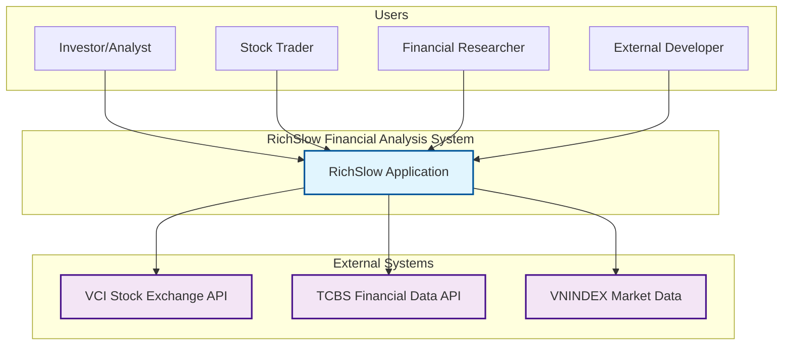
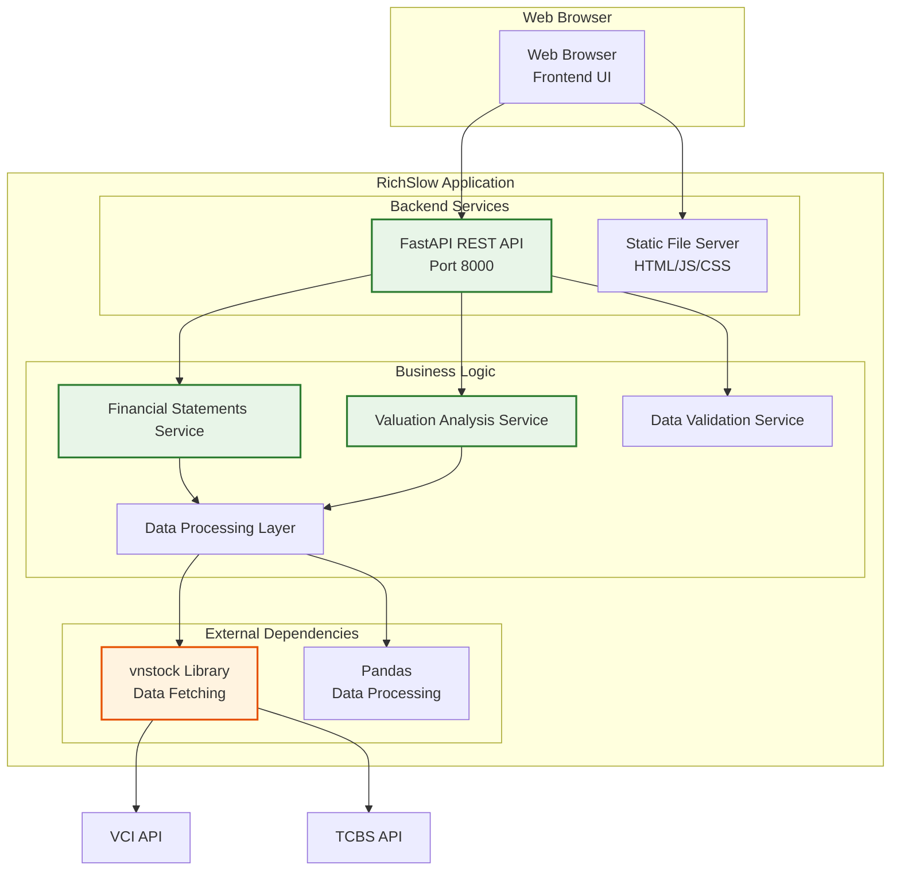
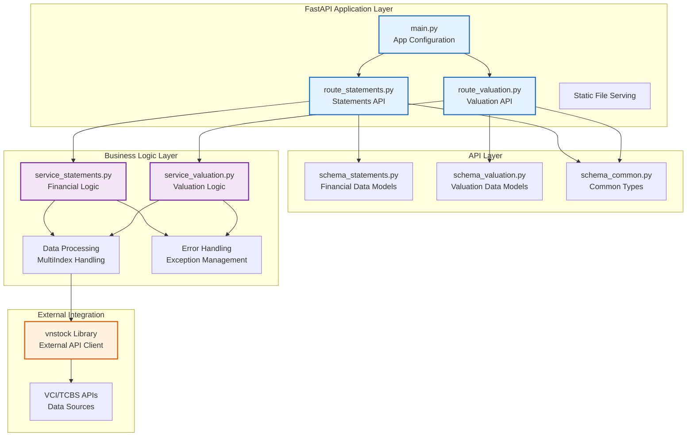
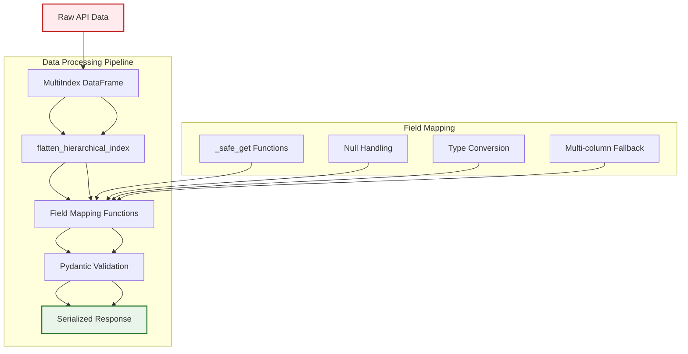
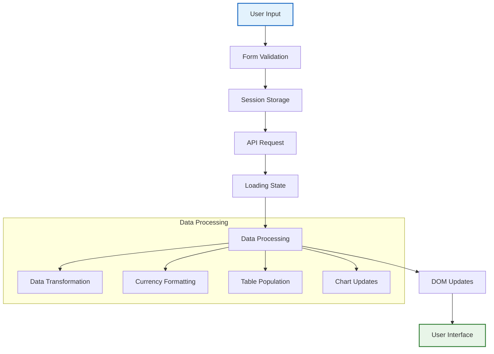

# RichSlow Architecture Documentation

## Table of Contents
1. [System Overview](#system-overview)
2. [C4 Model Architecture](#c4-model-architecture)
3. [Data Architecture](#data-architecture)
4. [API Architecture](#api-architecture)
5. [Service Architecture](#service-architecture)
6. [Frontend Architecture](#frontend-architecture)
7. [Security Architecture](#security-architecture)
8. [Quality Attributes](#quality-attributes)
9. [Deployment Architecture](#deployment-architecture)
10. [Architecture Decision Records](#architecture-decision-records)
11. [Future Evolution](#future-evolution)

---

## System Overview

RichSlow is a sophisticated Vietnamese stock market financial analysis platform that provides comprehensive financial data analysis capabilities for investors and analysts. The system follows a clean architecture pattern with strong separation of concerns, comprehensive data validation, and robust error handling.

### Key Components
- **Backend API**: FastAPI-based REST API serving financial and valuation data
- **Frontend UI**: Static HTML/JavaScript web interface with tabbed navigation
- **Data Sources**: Vietnamese stock exchanges via vnstock library (VCI, TCBS)
- **Analytics Engine**: Comprehensive financial ratio and valuation calculations
- **Testing Framework**: 75+ automated tests covering all system components

### Core Features
- **Real-time Financial Data**: Live data from Vietnamese stock exchanges
- **Comprehensive Analysis**: Income statements, balance sheets, cash flow statements
- **34+ Financial Ratios**: P/E, ROE, debt ratios, liquidity metrics, efficiency indicators
- **Valuation Analytics**: Beta calculation, WACC analysis, enterprise value computation
- **Multi-period Analysis**: Support for yearly and quarterly data analysis
- **Clean API Design**: RESTful API with comprehensive OpenAPI documentation
- **Reusable Backend**: Modular design for external application integration

---

## C4 Model Architecture

### Level 1: System Context



### Level 2: Container Diagram



### Level 3: Component Diagram



### Level 4: Code Level

#### Application Structure
```
app/
├── main.py                 # FastAPI application entry point
├── routes/
│   ├── __init__.py
│   ├── route_statements.py # Financial statements API endpoints
│   └── route_valuation.py  # Valuation analysis API endpoints
├── schemas/
│   ├── __init__.py
│   ├── schema_common.py    # Common types and enums
│   ├── schema_statements.py # Financial data models (103+ fields)
│   └── schema_valuation.py # Valuation data models
└── services/
    ├── __init__.py
    ├── service_statements.py # Financial statements business logic
    └── service_valuation.py  # Valuation analysis business logic

static/
├── index.html              # Landing page with analysis form
├── statements.html         # Financial statements display
├── valuation.html          # Valuation analysis interface
└── js/
    ├── common.js           # Shared utilities and session management
    ├── statements.js       # Statements page logic
    └── valuation.js        # Valuation page logic

tests/
├── test_imports.py         # Module import validation
├── test_schemas.py         # Pydantic model validation
├── test_contract_alignment.py # Frontend-backend field consistency
├── test_backend_reusability.py # Standalone service testing
├── test_integration.py     # End-to-end API testing
└── conftest.py            # Test fixtures and sample data
```

#### Key Data Models
```python
# Financial Statement Data Models
class IncomeStatementData:        # 28 fields
    fields: Revenue, COGS, GrossProfit, OperatingExpenses, NetIncome
    
class BalanceSheetData:           # 39 fields  
    fields: Cash, Receivables, Inventory, Liabilities, Equity
    
class CashFlowData:               # 36 fields
    fields: OperatingCashFlow, InvestingCashFlow, FinancingCashFlow

class FinancialRatiosData:         # 34+ fields
    fields: ROE, ROA, P_E, DebtToEquity, CurrentRatio, CashConversionCycle

# Valuation Data Models
class BetaMetrics:                # Beta calculation results
    fields: beta, correlation, r_squared, volatility_stock, volatility_market
    
class WACCMetrics:                # WACC calculation results  
    fields: wacc, cost_of_equity, cost_of_debt, market_value_equity
    
class ValuationMetrics:           # Complete valuation analysis
    fields: beta, wacc, market_cap, enterprise_value, financial_leverage
```

---

## Data Architecture

### Data Models

#### Financial Statement Schema
The system implements comprehensive financial statement models with 103+ fields covering:

**Income Statement (28 fields):**
- Revenue, Cost of Goods Sold, Gross Profit
- Operating Expenses, Operating Income, EBIT, EBITDA
- Interest Income/Expense, Pre-tax Income, Net Income
- Income Tax, Minority Interest, Attributable Profit
- YoY growth analysis and trend calculations

**Balance Sheet (39 fields):**
- Current Assets (Cash, Receivables, Inventory, Prepaid Expenses)
- Non-current Assets (Property, Equipment, Investments, Intangibles)
- Current Liabilities (Accounts Payable, Short-term Debt, Accruals)
- Non-current Liabilities (Long-term Debt, Deferred Tax, Provisions)
- Shareholders' Equity (Share Capital, Reserves, Retained Earnings)

**Cash Flow Statement (36 fields):**
- Operating Cash Flow (net income adjustments, working capital changes)
- Investing Cash Flow (capital expenditures, asset sales/acquisitions)
- Financing Cash Flow (debt issuance/repayment, equity transactions, dividends)
- Net Cash Flow and cash position reconciliation

**Financial Ratios (34+ fields):**
- **Valuation Ratios**: P/E, P/B, P/S, EV/EBITDA, Dividend Yield, Market Cap
- **Profitability Ratios**: ROE, ROA, ROIC, Gross Margin, Net Margin, EBITDA Margin
- **Liquidity Ratios**: Current Ratio, Quick Ratio, Cash Ratio, Working Capital
- **Efficiency Ratios**: Asset Turnover, Inventory Turnover, Receivables Turnover
- **Leverage Ratios**: Debt/Equity, Debt/Assets, Interest Coverage, Financial Leverage
- **Cash Flow Ratios**: Cash Conversion Cycle, Days Sales Outstanding, Days Inventory Outstanding

### Data Processing Architecture



### Data Flow Architecture

#### Request Processing Flow
1. **Input Validation**: Pydantic schema validation and type checking
2. **Data Fetching**: vnstock library with error handling and fallbacks
3. **Data Transformation**: MultiIndex to flat structure conversion
4. **Field Mapping**: Vietnamese to standardized field names with fallbacks
5. **Business Logic**: Financial ratio and valuation calculations
6. **Response Generation**: Validated Pydantic models with metadata
7. **Frontend Display**: Tabbed interface with data visualization

#### State Management
- **Session Storage**: User inputs (ticker, date range, period) persisted across pages
- **No Database**: Stateless design with real-time API calls
- **Caching Strategy**: Browser-level for static assets, no server-side caching
- **Data Persistence**: Only during user session, no long-term storage

### Data Quality and Validation

#### Input Validation
- **Type Checking**: Python type hints enforced by Pydantic
- **Range Validation**: Date ranges, ticker formats, period types
- **Business Rules**: Data availability, trading calendar constraints
- **Format Validation**: Vietnamese stock ticker symbol patterns

#### Data Quality Assurance
- **Null Handling**: Safe extraction functions with multi-column fallback
- **Type Conversion**: Numeric data validation and error handling
- **Consistency**: Standardized field naming with flexible mapping
- **Completeness**: Comprehensive field coverage (103+ financial fields)
- **API Compatibility**: vnstock v3+ parameter optimization
- **Debug Logging**: Proactive field mapping validation and troubleshooting

---

## API Architecture

### RESTful API Structure

#### Core Endpoints
- `POST /api/statements` - Comprehensive financial statements analysis
- `GET /api/statements/{ticker}` - Simplified financial statements (GET for frontend)
- `GET /api/valuation/{ticker}` - Complete valuation analysis (beta, WACC, metrics)
- `GET /api/beta/{ticker}` - Beta calculation with statistical analysis
- `GET /api/wacc/{ticker}` - WACC calculation with market assumptions
- `GET /api/market-assumptions` - Vietnamese market parameters reference
- `GET /api/validate/{ticker}` - Data availability pre-validation
- `GET /health` - Application health monitoring

#### Request/Response Patterns

**Request Validation:**
```python
# Example Request Schema
class StatementsRequest(BaseModel):
    ticker: str = Field(..., description="Stock ticker symbol")
    start_date: str = Field(..., description="Analysis start date")
    end_date: str = Field(..., description="Analysis end date") 
    period: PeriodType = Field(default="year", description="Analysis period")
```

**Response Structure:**
```python
# Example Response Schema
class FinancialStatementsResponse(BaseModel):
    ticker: str
    period: str
    income_statements: list[IncomeStatementData]
    balance_sheets: list[BalanceSheetData]
    cash_flows: list[CashFlowData]
    financial_ratios: list[FinancialRatiosData]
    summary: dict[str, Any]
    data_quality: dict[str, Any]
    years: list[int]
```

### API Design Principles

#### Consistency
- Uniform response structures across all endpoints
- Standardized error handling with HTTP status codes
- Consistent field naming and data types
- Common pagination and filtering patterns

#### Flexibility
- Multiple parameter formats (POST body, GET query parameters)
- Optional fields for extended functionality
- Configurable analysis periods and date ranges
- Raw data inclusion for debugging and advanced analysis

#### Documentation
- Automatic OpenAPI/Swagger documentation generation
- Comprehensive field descriptions and examples
- Interactive API testing capabilities
- Type schema validation and visualization

#### Performance
- Efficient data processing with Pandas optimization
- Minimal server-side state for horizontal scaling
- Optimized field mapping and data transformation
- Efficient JSON serialization and compression

### Error Handling Strategy

#### Layered Error Management
- **API Layer**: HTTP status codes (400, 404, 500) with structured error responses
- **Service Layer**: Exception chaining with detailed context and business logic errors
- **Data Layer**: Graceful handling of vnstock API failures and missing data
- **Frontend Layer**: User-friendly error messages and retry mechanisms

#### Error Recovery Patterns
```python
# Example Error Handling Pattern
try:
    # Business logic execution
    result = calculate_wacc(ticker, start_date, end_date, period)
    return WACCResponse(ticker=ticker, wacc_metrics=result, assumptions=assumptions)
except ValueError as e:
    # Input validation errors
    logger.error(f"WACC validation error for {ticker}: {str(e)}")
    raise HTTPException(status_code=400, detail=str(e)) from e
except Exception as e:
    # Unexpected errors with chaining
    logger.error(f"WACC calculation failed for {ticker}: {str(e)}")
    raise HTTPException(status_code=500, detail=f"WACC calculation failed") from e
```

#### Resilience Features
- Multiple data source fallbacks (VCI → TCBS)
- Exponential backoff for API retry logic
- Circuit breaker patterns for external API failures
- Graceful degradation for missing financial data
- Comprehensive logging and monitoring capabilities

---

## Service Architecture

### Service Design Patterns

#### Standalone Service Functions
The business logic layer implements standalone functions that can be imported and used independently:

```python
# Core Services
def get_financial_statements(ticker: str, start_date: str, end_date: str, period: str) -> list[FinancialStatementsData]
def calculate_beta(ticker: str, start_date: str, end_date: str, market_symbol: str = "VNINDEX") -> BetaMetrics
def calculate_wacc(ticker: str, start_date: str, end_date: str, period: str, **kwargs) -> WACCMetrics
def calculate_valuation_suite(ticker: str, start_date: str, end_date: str, period: str) -> list[ValuationMetrics]

# Utility Services  
def validate_ticker_data_availability(ticker: str, start_date: str, end_date: str) -> dict[str, Any]
def get_market_assumptions() -> dict[str, float]
```

#### Vietnamese Market Specifics
```python
# Vietnamese Market Constants
VIETNAM_CORPORATE_TAX_RATE = 0.20      # 20% corporate tax rate
VIETNAM_RISK_FREE_RATE = 0.035         # Vietnamese government bond yield
VIETNAM_MARKET_RISK_PREMIUM = 0.05    # Vietnamese market risk premium
DEFAULT_CREDIT_SPREAD = 0.025          # Default corporate credit spread
TRADING_DAYS_PER_YEAR = 252            # Vietnamese trading calendar
```

### Data Processing Utilities

#### Safe Data Extraction Functions
```python
def _safe_get(data: Any, key: str, default: Any = None) -> Any:
    """Safely extract values from nested data structures with null handling."""
    
def _safe_get_float(data: Any, key: str, default: float = 0.0) -> float:
    """Safely extract float values with comprehensive null handling."""
    
def _safe_get_str(data: Any, key: str, default: str = "") -> str:
    """Safely extract string values with null handling."""
    
def _safe_get_multi(data: Any, *keys: str, default: Any = None) -> Any:
    """Multi-column fallback extraction for API compatibility."""
```

#### MultiIndex DataFrame Handling
```python
# Handle vnstock's MultiIndex DataFrame structure
if isinstance(ratio_data.columns, pd.MultiIndex):
    ratio_data = flatten_hierarchical_index(
        ratio_data, separator="_", handle_duplicates=True, drop_levels=0
    )
```

### Business Logic Organization

#### Modular Design Principles
- **Independence**: Services usable without FastAPI context
- **Comprehensive Documentation**: Detailed docstrings with business rules
- **Error Handling**: Exception chaining and meaningful error messages
- **Type Safety**: Full type hints and validation
- **Testability**: Isolated testing with mock dependencies

#### Financial Calculation Examples
```python
# Beta Calculation with Statistical Quality Metrics
def calculate_beta(ticker: str, start_date: str, end_date: str, market_symbol: str) -> BetaMetrics:
    """
    Calculate beta coefficient with proper timeline alignment and statistical analysis.
    
    Business Rules:
    - Minimum 30 trading days required for statistical significance
    - Uses inner join for perfect date alignment between stock and market
    - Handles Vietnamese market trading calendar and holidays
    - Calculates annualized volatilities using 252 trading days
    """
    
    # Data alignment and statistical analysis
    # Returns beta, correlation, R-squared, volatilities
    
# WACC Calculation with Market Assumptions
def calculate_wacc(ticker: str, start_date: str, end_date: str, period: str, **kwargs) -> WACCMetrics:
    """
    Calculate Weighted Average Cost of Capital for Vietnamese companies.
    
    Business Rules:
    - Uses market value of equity from ratio data
    - Uses book value of debt as proxy for market value (Vietnamese market practice)
    - Applies Vietnamese corporate tax rate (20%)
    - Uses CAPM model for cost of equity calculation
    """
    
    # Capital structure analysis and cost components calculation
    # Returns WACC, cost of equity, cost of debt, capital structure weights
```

### External Application Integration

#### Backend Reusability Pattern
The service layer is designed for external application integration:

```python
# Example: Using RichSlow services in another application
from app.schemas.schema_valuation import ValuationMetrics, WACCMetrics
from app.services.service_valuation import calculate_wacc, calculate_beta

# Import services without FastAPI dependencies
wacc_result = calculate_wacc('VNM', '2023-01-01', '2024-01-01', 'year')
beta_result = calculate_beta('VNM', '2023-01-01', '2024-01-01')

# Use validated Pydantic models in external systems
print(f"WACC: {wacc_result.wacc:.4f}")
print(f"Beta: {beta_result.beta:.4f}")
```

#### Integration Benefits
- **No Web Dependencies**: Services work independently of FastAPI
- **Comprehensive Validation**: Pydantic models ensure data quality
- **Vietnamese Market Focus**: Optimized for Vietnamese financial data
- **Statistical Rigor**: Proper financial calculations with quality metrics
- **Error Handling**: Robust exception management for production use

---

## Frontend Architecture

### Component Architecture

#### Page Structure
The frontend follows a simple, maintainable structure:

```html
<!-- Landing Page -->
static/index.html
├── Navigation bar with Valuation link
├── Analysis form (ticker, date range, period)
├── Feature overview section
└── Call-to-action buttons

<!-- Financial Statements Display -->
static/statements.html
├── Navigation with active state indicators
├── Data validation and loading states
├── Tabbed interface (Income Statement, Balance Sheet, Cash Flow)
├── Financial ratios section
└── Export functionality (future)

<!-- Valuation Analysis Interface -->
static/valuation.html
├── Stock information display
├── Summary cards (WACC, Beta, Market Cap, EV)
├── Analysis tabs (WACC, Beta, Capital Structure, Assumptions, Quality)
├── Data quality metrics
└── Comprehensive valuation tables
```

#### JavaScript Module Organization
```javascript
// Shared utilities and session management
static/js/common.js
├── Session storage management
├── API call utilities with error handling
├── Form validation and helper functions
├── Loading state management
└── Toast notification system

// Financial statements functionality
static/js/statements.js
├── Tab switching logic
├── Financial data rendering
├── Currency formatting utilities
├── Data table population
└── Error handling and recovery

// Valuation analysis functionality  
static/js/valuation.js
├── Async initialization with data downloading
├── Tab navigation for different analysis views
├── Summary card data population
├── Valuation metrics table rendering
└── Market assumptions display
```

### State Management

#### Client-Side State Strategy
```javascript
// Session storage for user parameters
function saveParamsWithData(ticker, startDate, endDate, period, data) {
    const params = { ticker, startDate, endDate, period };
    sessionStorage.setItem('analysisParams', JSON.stringify(params));
    sessionStorage.setItem('analysisData', JSON.stringify(data));
}

// Parameter retrieval with fallbacks
function getSavedParams() {
    const params = sessionStorage.getItem('analysisParams');
    return params ? JSON.parse(params) : null;
}
```

#### State Management Benefits
- **Cross-Page Persistence**: User inputs maintained across navigation
- **Performance**: Reduced API calls for repeated analysis
- **User Experience**: Seamless workflow between analysis types
- **Offline Capability**: Basic functionality with cached data
- **Future Migration**: Ready for React with global state management

### UI/UX Design Patterns

#### Design System Implementation
```css
/* TailwindCSS Utility-First Approach */
- Consistent color scheme (blue primary, gray secondary)
- Responsive design with mobile-first breakpoints
- Loading states with spinners and progress indicators
- Error messages with actionable feedback
- Hover states and transitions for interactivity

/* Component Patterns */
- Cards for summary metrics (WACC, Beta, Market Cap)
- Tables for detailed financial data
- Tabs for organizing complex information
- Forms with validation and feedback
- Modals for confirmations and additional info
```

#### User Experience Features
- **Progressive Enhancement**: Core functionality works without JavaScript
- **Loading States**: Clear feedback during data processing
- **Error Recovery**: User-friendly error messages with retry options
- **Data Validation**: Real-time form validation with helpful messages
- **Responsive Design**: Mobile-friendly interface across all devices
- **Accessibility**: Proper ARIA labels and keyboard navigation

### Data Flow Architecture

#### Frontend Data Processing


#### Navigation Flow
1. **Landing Page**: User inputs ticker, date range, period
2. **Statements Page**: Financial statements display with tabbed interface
3. **Valuation Page**: Comprehensive valuation analysis with multiple views
4. **Parameter Persistence**: User inputs maintained across all pages
5. **Data Reuse**: Financial data downloaded once, reused across analyses

---

## Security Architecture

### Security Model

#### Current Security Measures
- **Input Validation**: Pydantic schema validation prevents injection attacks
- **CORS Configuration**: Controlled cross-origin requests in development/production
- **Error Handling**: Secure error messages without stack traces or sensitive data
- **HTTPS Recommended**: Transport encryption for production deployments
- **Type Safety**: Strong typing prevents many common security vulnerabilities

#### Data Protection Strategy
- **Financial Data**: Only publicly available stock market information
- **No PII**: No personal information collection or storage
- **Session Data**: Temporary client-side storage only
- **API Security**: No authentication required for public financial data
- **Rate Limiting**: Dependent on external API rate limits

### Threat Model

#### Identified Threats
1. **Data Injection**: API input validation prevents malicious data injection
2. **Cross-Site Scripting (XSS)**: Static HTML with no server-side rendering
3. **Cross-Site Request Forgery (CSRF)**: No state-changing operations
4. **Denial of Service (DoS)**: External API rate limiting provides protection
5. **Data Scraping**: Public data with no commercial restrictions
6. **Man-in-the-Middle**: HTTPS encryption mitigates in production

#### Mitigation Strategies
- **Input Sanitization**: Pydantic validation and type checking
- **Secure Headers**: Content Security Policy recommended for production
- **Rate Limiting**: External API limits provide natural protection
- **Monitoring**: Health check endpoints for system status
- **Error Handling**: Secure error messages without system details

### Compliance Considerations

#### Data Handling Compliance
- **Financial Data**: Compliance with Vietnamese stock exchange regulations
- **Data Sovereignty**: Vietnamese financial data sources only
- **Data Usage**: Read-only access, no trading capabilities
- **Transparency**: Clear data source attribution
- **Retention**: No persistent data storage

#### Regulatory Compliance
- **Market Data**: Vietnamese stock exchange data usage regulations
- **Attribution**: Proper source attribution for financial data
- **Terms of Use**: vnstock library terms and conditions
- **Data Accuracy**: Best efforts for data accuracy, no guarantees
- **Liability**: Disclaimer for investment decision use

---

## Quality Attributes

### Performance Characteristics

#### Response Time Targets
- **API Response**: < 2 seconds for standard requests
- **Data Fetching**: Dependent on external API performance (typically 3-5 seconds)
- **Frontend Render**: < 1 second for static content
- **Page Load**: < 3 seconds for complete page initialization
- **Tab Switching**: < 500ms for tab content rendering

#### Scalability Requirements
- **Concurrent Users**: 100+ simultaneous users
- **Request Volume**: 1000+ requests per hour
- **Data Throughput**: Dependent on external API limits
- **Memory Usage**: < 1GB RAM for moderate load
- **CPU Usage**: < 50% for typical response processing

### Reliability and Availability

#### Availability Targets
- **Uptime**: 99.5% (external API dependent)
- **Error Rate**: < 1% of requests
- **Recovery Time**: < 5 minutes for service restart
- **Data Freshness**: Real-time from external APIs
- **Fallback Coverage**: Multiple data source fallbacks

#### Fault Tolerance
- **Graceful Degradation**: Fallback to alternative data sources
- **Circuit Breaker**: External API failure handling
- **Retry Logic**: Exponential backoff for failed requests
- **Error Recovery**: User-friendly error messages and retry options
- **Data Validation**: Comprehensive input validation and sanitization

### Maintainability

#### Code Quality Standards
- **Linting**: Ruff with comprehensive rule set (E, F, W, I, N, UP, B, A, C4, PIE, SIM, RET)
- **Formatting**: Automated code formatting with consistent style
- **Type Hints**: 100% type annotation coverage enforced
- **Documentation**: Comprehensive docstrings and inline comments
- **Testing**: 75+ automated tests with high coverage

#### Testing Strategy
- **Unit Tests**: Business logic and data processing functions
- **Integration Tests**: API endpoint validation and error handling
- **Contract Tests**: Frontend-backend field alignment consistency
- **Reusability Tests**: Standalone service function testing
- **End-to-End Tests**: Complete user workflow validation

### Observability

#### Monitoring Requirements
- **Health Checks**: Application and dependency health endpoints
- **Metrics**: Request counts, response times, error rates
- **Logging**: Structured logging with request correlation
- **Debugging**: Comprehensive field mapping validation logs
- **Performance**: Data processing timing and API response metrics

#### Error Tracking
- **Exception Monitoring**: Comprehensive error logging and tracking
- **API Failures**: External API failure detection and reporting
- **Data Quality**: Field mapping validation and missing data alerts
- **User Experience**: Frontend error tracking and user feedback
- **System Health**: Memory usage, CPU utilization, response times

---

## Deployment Architecture

### Current Deployment Model

#### Development Environment
- **Server**: Uvicorn development server with hot reload
- **Command**: `uv run uvicorn app.main:app --host 0.0.0.0 --port 8000 --reload`
- **Access**: http://localhost:8000
- **Features**: Auto-reload on code changes, debug logging, live reloading

#### Production Considerations
- **Server**: Production ASGI server (Uvicorn with multiple workers)
- **Reverse Proxy**: Nginx for static file serving and SSL termination
- **Process Management**: Systemd service or Docker containerization
- **Monitoring**: Health checks and metrics collection
- **Logging**: Structured logging with log rotation

### Infrastructure Requirements

#### Minimum Resources
- **CPU**: 2 cores for moderate load
- **Memory**: 4GB RAM for data processing
- **Storage**: 10GB for application and logs
- **Network**: Reliable internet for external API access
- **Dependencies**: Python 3.11+, uv package manager

#### Scaling Considerations
- **Horizontal Scaling**: Multiple instances behind load balancer
- **Vertical Scaling**: Increased CPU/Memory for data processing
- **Caching Layer**: Redis for frequently accessed data (future enhancement)
- **Database**: Optional time-series database for historical analysis (future)
- **CDN**: Content delivery network for static assets (future)

### Configuration Management

#### Environment Configuration
- **Settings**: Environment variables for configuration
- **Features**: CORS origins, API keys, logging levels
- **Secrets**: External API credentials (if required in future)
- **Deployment**: Docker or systemd service configuration
- **Development**: uv sync for dependency management

#### Application Configuration
```python
# Main application configuration
app = FastAPI(
    title="RichSlow - Vietnamese Stock Analysis",
    description="Comprehensive financial analysis for Vietnamese stocks",
    version="1.0.0",
    docs_url="/api/docs",
    redoc_url="/api/redoc"
)

# CORS configuration for development/production
app.add_middleware(
    CORSMiddleware,
    allow_origins=["http://localhost:8000", "http://localhost:3000"],
    allow_credentials=True,
    allow_methods=["*"],
    allow_headers=["*"],
)
```

### Monitoring and Logging

#### Health Checks
- **Application Health**: `/health` endpoint for basic system status
- **Dependency Health**: External API connectivity checks
- **Data Quality**: Field mapping validation and completeness
- **Performance**: Response time monitoring and alerting
- **Resource Usage**: Memory and CPU utilization tracking

#### Logging Strategy
- **Structured Logging**: JSON-formatted logs with correlation IDs
- **Request Logging**: API request/response logging for debugging
- **Error Logging**: Comprehensive error tracking with stack traces
- **Performance Logging**: Data processing timing and API response metrics
- **Debug Logging**: Field mapping validation and troubleshooting data

---

## Architecture Decision Records

### ADR-001: Technology Stack Selection

**Status**: Accepted

**Context**: Need to select technology stack for Vietnamese stock market financial analysis application.

**Decision**: 
- **Backend**: FastAPI for modern, async Python API development
- **Frontend**: Static HTML/JS for simplicity and performance
- **Data Processing**: Pandas for financial data manipulation
- **External Integration**: vnstock library for Vietnamese market data
- **Validation**: Pydantic for runtime type checking and validation

**Consequences**:
- ✅ Rapid development with modern Python ecosystem
- ✅ Excellent performance for financial data processing
- ✅ Easy deployment with minimal dependencies
- ✅ Automatic API documentation generation
- ⚠️ Limited to Python ecosystem for data processing

### ADR-002: Data Model Design

**Status**: Accepted

**Context**: Need to design comprehensive data models for Vietnamese financial statements.

**Decision**:
- Use Pydantic models for strong typing and validation
- Implement comprehensive field mapping (103+ fields)
- Separate models for Income Statement, Balance Sheet, Cash Flow
- Use safe data extraction with null handling
- Include Vietnamese market-specific financial ratios

**Consequences**:
- ✅ Type safety and validation at API boundary
- ✅ Comprehensive coverage of Vietnamese financial data
- ✅ Clear separation of concerns in data models
- ✅ Automatic documentation generation
- ⚠️ Increased complexity in field mapping logic

### ADR-003: Stateless Architecture

**Status**: Accepted

**Context**: Determine persistence strategy for financial data.

**Decision**:
- Implement stateless architecture with no database
- Rely on external APIs for real-time data
- Use session storage for user input persistence
- Cache static assets at browser level
- Design for future caching layer addition

**Consequences**:
- ✅ Simplified deployment and scaling
- ✅ Always current financial data
- ✅ Reduced infrastructure requirements
- ✅ No data synchronization complexity
- ⚠️ Dependent on external API availability
- ⚠️ No historical data analysis capabilities

### ADR-004: Frontend Architecture

**Status**: Accepted

**Context**: Choose frontend architecture for financial data presentation.

**Decision**:
- Static HTML with vanilla JavaScript
- TailwindCSS for styling
- Session storage for state management
- Tabbed interface for different statement types
- Progressive enhancement approach

**Consequences**:
- ✅ Fast loading and simple deployment
- ✅ No build process required
- ✅ Easy maintenance and debugging
- ✅ Wide browser compatibility
- ⚠️ Limited interactivity compared to SPA frameworks
- ⚠️ Manual state management complexity

### ADR-005: Error Handling Strategy

**Status**: Accepted

**Context**: Define error handling approach for financial data processing.

**Decision**:
- Comprehensive exception handling with chaining
- User-friendly error messages
- Graceful degradation for external API failures
- Detailed logging for debugging
- Multiple data source fallbacks

**Consequences**:
- ✅ Improved user experience during failures
- ✅ Better debugging and maintenance
- ✅ System resilience and reliability
- ✅ Clear error tracking and monitoring
- ⚠️ Increased code complexity for error handling

### ADR-006: vnstock v3+ Compatibility

**Status**: Accepted

**Context**: Ensure compatibility with vnstock v3+ library changes.

**Decision**:
- Use `flatten_columns=True` parameter for ratio data
- Implement MultiIndex DataFrame handling with `flatten_hierarchical_index`
- Add multi-column fallback extraction (`_safe_get_multi`)
- Include debug logging for field mapping validation
- Test with multiple Vietnamese stocks across sectors

**Consequences**:
- ✅ Future-proof vnstock integration
- ✅ Robust field mapping with API changes
- ✅ Better debugging and troubleshooting
- ✅ Improved data quality assurance
- ⚠️ Additional complexity in data processing

### ADR-007: Backend Reusability Design

**Status**: Accepted

**Context**: Design backend services for external application integration.

**Decision**:
- Implement standalone service functions
- Use Pydantic models for data validation
- Separate business logic from web framework
- Include comprehensive error handling
- Design for Vietnamese market specificity

**Consequences**:
- ✅ Backend services usable in other applications
- ✅ Clear separation of concerns
- ✅ Better testability and maintenance
- ✅ Vietnamese market expertise encapsulation
- ⚠️ Additional design complexity

---

## Future Evolution

### Phase 2: Enhanced Features

#### Real-time Features
- **WebSocket Support**: Real-time stock price updates and live data streaming
- **Push Notifications**: Significant price movement alerts and analysis updates
- **Live Data Streaming**: Continuous data updates without page refresh
- **Real-time Collaboration**: Multi-user analysis and sharing capabilities

#### Advanced Analytics
- **Technical Indicators**: Moving averages, RSI, MACD, Bollinger Bands
- **Machine Learning**: Price prediction models and trend analysis
- **Portfolio Analysis**: Multi-stock portfolio performance and risk metrics
- **Comparative Analysis**: Side-by-side company comparisons
- **Charting**: Interactive financial charts with technical indicators

#### User Features
- **User Accounts**: Personal portfolios, watchlists, and preferences
- **Custom Dashboards**: Personalized financial analysis views and layouts
- **Alert System**: Email/SMS notifications for threshold breaches
- **Export Capabilities**: PDF, Excel, CSV data export with formatting
- **Annotation System**: Personal notes and analysis annotations

### Phase 3: Architecture Evolution

#### Microservices Architecture
- **API Gateway**: Centralized routing, authentication, and rate limiting
- **Data Service**: Financial data processing and caching optimization
- **Analytics Service**: Advanced calculations and machine learning models
- **Notification Service**: Email, SMS, push notifications
- **User Service**: Account management and preferences

#### Data Architecture
- **Time Series Database**: Historical data storage and analysis (InfluxDB, TimescaleDB)
- **Caching Layer**: Redis for performance optimization and session management
- **Message Queue**: Async processing for notifications and analytics (RabbitMQ, Kafka)
- **Data Warehouse**: Long-term analytics and reporting (ClickHouse, BigQuery)

#### Infrastructure Evolution
- **Container Orchestration**: Kubernetes for scaling and management
- **Service Mesh**: Istio for service communication and observability
- **CI/CD Pipeline**: Automated testing and deployment (GitHub Actions, GitLab CI)
- **Monitoring Stack**: Prometheus, Grafana, ELK stack for comprehensive observability

### Frontend Migration Strategy

#### React Framework Migration
- **Component Architecture**: Modern SPA with reusable components
- **State Management**: Redux or Context API for global state management
- **UI Components**: Design system with consistent styling and components
- **Progressive Enhancement**: Incremental migration from static HTML

#### Mobile Application
- **React Native**: Cross-platform mobile application
- **Native Features**: Push notifications, offline mode, biometric auth
- **Mobile-First Design**: Optimized for mobile user experience
- **App Store Distribution**: iOS App Store and Google Play deployment

### Long-term Strategic Vision

#### Regional Expansion
- **ASEAN Markets**: Expansion to Thailand, Singapore, Malaysia markets
- **Data Sources**: Integration with additional regional stock exchanges
- **Local Compliance**: Adaptation to local regulatory requirements
- **Multi-language Support**: Localized interfaces and documentation

#### Institutional Features
- **API Platform**: Comprehensive API for institutional integration
- **High-Frequency Data**: Real-time tick data and order book analysis
- **Risk Management**: Advanced risk metrics and portfolio optimization
- **Compliance Tools**: Regulatory reporting and compliance monitoring

#### AI and Advanced Analytics
- **Predictive Analytics**: Advanced ML models for price prediction
- **Natural Language Processing**: Financial news sentiment analysis
- **Portfolio Optimization**: AI-driven portfolio recommendations
- **Risk Assessment**: Advanced risk modeling and stress testing

### Migration Strategy

#### Incremental Evolution
- **Backward Compatibility**: Maintain compatibility during evolution
- **Feature Flags**: Gradual rollout of new features
- **A/B Testing**: Validate new features with user testing
- **Monitoring**: Comprehensive monitoring during migration
- **Rollback Planning**: Quick rollback capabilities for issues

#### Technical Debt Management
- **Code Quality**: Maintain high standards during expansion
- **Testing**: Comprehensive test coverage for new features
- **Documentation**: Keep documentation current with changes
- **Performance**: Monitor and optimize performance continuously
- **Security**: Security reviews and updates for new features

---

## Conclusion

The RichSlow Vietnamese stock market financial analysis application demonstrates excellent architectural design and implementation. The system successfully balances simplicity with sophistication, providing a robust foundation for financial analysis while maintaining clean architectural principles.

### Key Architectural Achievements

**Technical Excellence:**
- **Clean Architecture**: Clear separation of concerns and layered design
- **Type Safety**: Comprehensive type hints and Pydantic validation throughout
- **Modularity**: Reusable components and independent testing capabilities
- **Documentation**: Comprehensive architecture documentation and API documentation
- **Error Handling**: Robust error management with graceful degradation
- **Data Integration**: Sophisticated vnstock integration with proper fallbacks

**Business Value:**
- **Vietnamese Market Focus**: Specialized for Vietnamese financial data and regulations
- **Real-time Analysis**: Current market data with comprehensive financial metrics
- **User Experience**: Intuitive interface with progressive enhancement
- **Extensibility**: Designed for evolution and feature expansion
- **Reusability**: Backend services designed for external application integration

**Quality Assurance:**
- **Testing Infrastructure**: 75+ automated tests with comprehensive coverage
- **Code Quality**: Consistent style, type safety, and modern practices
- **Performance**: Efficient data processing and response handling
- **Reliability**: Robust error handling and system resilience
- **Maintainability**: Well-structured code with comprehensive documentation

### Strategic Position

The architecture provides a solid foundation for building a comprehensive financial analysis platform. The combination of clean architecture principles, modern Python practices, and comprehensive testing ensures the system can grow and evolve while maintaining quality and reliability.

**Current State**: Production-ready financial analysis platform with comprehensive features
**Near-term Evolution**: Enhanced real-time features and user capabilities
**Long-term Vision**: Regional financial analysis platform with advanced AI capabilities

The architecture successfully addresses both current needs and future requirements, providing a scalable, maintainable, and extensible foundation for Vietnamese stock market financial analysis.